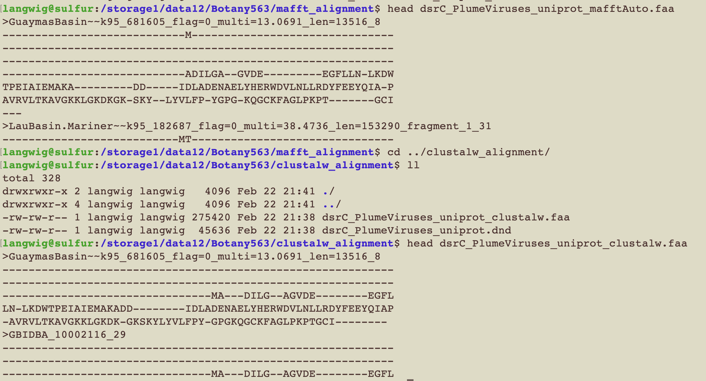

Link to Claudia's helpful guide: [mindful-programming](https://github.com/crsl4/mindful-programming/blob/master/lecture.md)

# Dealing with git conflicts
```
nano best-books.md 

git add .

git commit -m "maggie's book"

git push

git remote add upstream https://github.com/crsl4/phylo-class-social
```

This will produce errors:
```
git pull upstream master
```

To fix it, change the file however you want it to look using nano. Then repeat:

```
nano best-books.md 

git add .

git commit -m "maggie's book"

git push
```
THEN, go to github website and request pull from your own account

Can use this to go back to before you made a change if you haven't done git add:
```
git checkout --
```

# Basics of Git
Look at git config
```
git config -v
```

See what git channels you are connected to:
```
git remote -v
```

If upstream channel is not the one you expect (in our case /crsl4/phylo-class-social), use this to change:
```
git remote add upstream https://github.com/crsl4/phylo-class-social
```

# Reproducibility Homework Part 3
On Github website, fork from [here](https://github.com/crsl4/phylogenetics-class/blob/master/exercises/class-repos.md)

Now git clone your forked repo
```
git clone https://github.com/mlangwig/phylogenetics-class.git
```

See that you are currently linked to your own repos:
```
margueritelangwig@Marguerites-MacBook-Pro phylogenetics-class % git remote -v         
origin	https://github.com/mlangwig/phylogenetics-class.git (fetch)
origin	https://github.com/mlangwig/phylogenetics-class.git (push)
```

So we want to add the original repo upstream to be able to push to it:
```
git remote add upstream https://github.com/crsl4/phylogenetics-class
```

Now check:
```
margueritelangwig@Marguerites-MacBook-Pro phylogenetics-class % git remote -v
origin	https://github.com/mlangwig/phylogenetics-class.git (fetch)
origin	https://github.com/mlangwig/phylogenetics-class.git (push)
upstream	https://github.com/crsl4/phylogenetics-class (fetch)
upstream	https://github.com/crsl4/phylogenetics-class (push)
```

Nano exercises/class-repos.md, add your link, then:
```
git add .

git commit -m "maggie's github link"

git push
```

Now go to the Github website, go to the file that you changed in your forked git repo, click Pull Requests in the top left corner, New pull request (this should show you the changes you made in the file), and then Create pull request

# dsrC class project

Justification: DsrC is a small protein that partners with DsrAB to catalyze dissimilatory sulfur cycling. DsrC is part of a superfamily of proteins that have different names and completely different functions (TusE for biosynthesis of 2-thiouridine, RspA for regulation of gene expression). One way to distinguish between them and find out what function you have is to make a phylogeny.
My phylogeny will include a viral dsrC/tusE that I identified in a virus integrated with Marinobacter to see how it is related to other Marinobacter and viral dsr/tus/rspA sequences.

## Acquire the sequences
1. Get known dsrCs and known tusE references from Uniprot:
[Uniprot search results](https://www.uniprot.org/blast/uniprot/B202202144ABAA9BC7178C81CEBC9459510EDDEA302E3E7D)

2. Download all Marinobacter genomes in NCBI, will search these for dsrC:
[NCBI search results](https://www.ncbi.nlm.nih.gov/datasets/genomes/?taxon=2742&utm_source=gquery&utm_medium=referral)

3. Obtained viral reference sequences of dsrC/tusE from Kris in my lab

4. Get reference sequences from [Venceslau et al., 2014](https://www.sciencedirect.com/science/article/pii/S0005272814000942#f0025)

5. 3 viral sequences identified from hydrothermal plume metagenomes using [VIBRANT](https://microbiomejournal.biomedcentral.com/articles/10.1186/s40168-020-00867-0)

### Identify dsrC/tusE from Marinobacter genomes
Confirm that the genome set you have is actually Marinobacter according to [GTDBtk](https://academic.oup.com/bioinformatics/article/36/6/1925/5626182)
```
gtdbtk classify_wf --genome_dir /storage1/data12/Plume_Viruses/Marinobacter_MAGs/fna --out_dir GTDB -x fna --cpus 10 --pplacer_cpus 10 --tmpdir /storage1/data12/tmp/
```
This resulted in a final set of 344 Marinobacter genomes, compared to the 346 downloaded

Run the hmmsearch using custom sulfur hmm database from our lab
```
for file in sulfur_hmms/*.hmm; do hmmsearch --cut_tc --cpu 15 --tblout $file.txt $file Marinobacter_344genomes.faa; echo "next hmm"; done
```

Paste list of hits into a txt file for extracting seqs
```
nano dsrC_Marinobacter_list.txt
```

Extract them from the genomes
```
perl /storage1/data12/scripts/screen_list_new.pl dsrC_Marinobacter_list.txt ../346_Marinobacter.faa keep > dsrC_Marinobacter.faa
```

## Sequence Totals
In total have:

* 342 seqs from Marinobacter ref genomes: dsrC_Marinobacter.faa
* 250 refs downloaded from Uniprot: uniprot_dsrC_seqs.faa
* 138 IMGVR refs from Kris through teams: DsrC_IMGVR.faa
* 3 dsrCs from VIBRANT characterizations: dsrC_3viruses.faa
* 76 dsrC references from Venceslau et al: Venceslau_76_dsrC.faa 
    
Cat them all for final set of 809 sequences:
```
cat *.faa > dsrC_PlumeViruses_uniprot.faa
```

## Alignments

1. Starting with [ClustalW](https://www.ncbi.nlm.nih.gov/labs/pmc/articles/PMC308517/), default parameters

```
clustalw -INFILE=dsrC_PlumeViruses_uniprot.faa -align -OUTFILE=dsrC_PlumeViruses_uniprot_clustalw.faa -OUTPUT=FASTA
```

2. Trying out [MAFFT](https://academic.oup.com/mbe/article/30/4/772/1073398?login=true) because it is commonly used in my lab and I want to learn more about it. In the help page they suggest using the --auto option if you don't know which of their high accuracy options to use so trying that:

```
mafft --auto dsrC_PlumeViruses_uniprot.faa > mafft_alignment/dsrC_PlumeViruses_uniprot_mafftAuto.faa
```

They are noticeably different when previewing:


## **Phylogenies**

### **Distance trees**
Distance trees fit a tree to a matrix of pairwise genetic distances. First, pairwise distances are calculated based on the fraction of positions in which the two sequences differ. Next, this dissimilarity is converted into an evolutionary distance by applying an evolutionary model (e.g., Jukes Cantor) to estimate the number of substitutions that occurred. Finally, the tree topology can be inferred on the basis of the estimated 
evolutionary distances.

**Neighbor Joining**: [explanation of method]

**Method**|**Strengths**|**Limitations**|**Assumptions**|**Why method is a good choice**
:-----:|:-----:|:-----:|:-----:|:-----:
| Neighbor Joining | •Can produce optimum tree without having to search the tree space <br /> •Fast | •Does not have model flexibility <br /> •Less statistical power because NJ reduces phylogenetic info to 1 value per pair of sequences (non-character based) |  •Your chosen evolutionary model is valid <br /> •Distance calculations are accurate (can be affected by noisy distances)    |          |

Relevant links and references:

* [Saitou and Nei, 1987](https://pubmed.ncbi.nlm.nih.gov/3447015/)

### **Parsimony trees**

**Maximum Parsimony**: This method seeks to minimize the evolutionary change required to explain the data. In other words, the tree with the fewest common ancestors in most likely. It does not rely on models of evolution and is a character-based method (utilizes 4 nucleotides or 20 amino acids).

**Method**|**Strengths**|**Limitations**|**Assumptions**|**Why method is a good choice**
:-----:|:-----:|:-----:|:-----:|:-----:
| Maximum Parsimony | •Intuitive and simple criterion for tree building | •Produce inconsistent trees (especially when there is long branch attraction) <br /> •Limited use for large trees (>1000 taxa) because finding most parsimonious tree becomes NP-hard <br /> •Often underestimates actual evolutionary change | Independence among characters |   |

Relevant links and references:

* [Camin and Sokal, 1965](https://www.jstor.org/stable/pdf/2406441.pdf)
* [Felsenstein, 1978](https://watermark.silverchair.com/27-4-401.pdf?token=AQECAHi208BE49Ooan9kkhW_Ercy7Dm3ZL_9Cf3qfKAc485ysgAAAugwggLkBgkqhkiG9w0BBwagggLVMIIC0QIBADCCAsoGCSqGSIb3DQEHATAeBglghkgBZQMEAS4wEQQM6zvVOy7HsYFR1i6FAgEQgIICmzHtLDuAfOznd9eXR7Uu2GWcqsZiH3ilRhS72EkF3mteNNDTx-ibu1VcO0yUC-QNdF_f01vViCT2u4UlofQl36h2kN7WpLG_fPSHg_U_cnOJ_CXUxfk1XhBZ6Ng8mgEHmNJMOwj6meuso4IAxP5iRoPU7EaPLiuEBtYukXu-d9BuIlpSQT2-PDIwozhiLsXyxGUFyEX77nce4ldL0RiZryBC5k8JIOKUaXiXZ-OmNjcV7dhrIsHFxlH3gn5Aubjr43m-JEW0TEQ9swS9HWFcQUQ51D7K3Fy6g8-lXvknXNwuZLMZEI5XJBI4vlTzCKMQ_DYNipfQXkdeUYD2dK868G_rjvUSALZGf-6Zu5U6xxYRRYijiczI5SQYNY2pLPzdafTN16aTcydeBZfkcH7TLcGGDzd1Q0huby0IXBvCdX6rYvM8uI2OlCngEnHCO-mHD4sjlqEk7IKtNP0Gj3OONOsuq79bNsanetcJciTULVGdbyjXFJbDdE3FSgPyyYziyEiLVZcM64alaMR7o6L80ZXBhDrSQt0GUZIMAZdpFYdrawMhrBws13M8N7FgT_aMJLLRDooucgSu6j8MgOfJQaWFpf2z3vDMu4uiyYLbSRfaPLdd3omJHAj3wjngywXeMLF7ZSvVds_DTsR6YbCBrkPbeJQjaEfyQ6SAqgYeWsteuhotHsJDIdDmmba6jCNAUVw7zq4eEfMptE9kBvhUL7PTyi-wcuVr-1VvZJm3pmBCsM5qLLMumJMMWACUcEt5bjEarVukSYX3Hm_pTB6WXfTFIR-3IbI3YwctcxGNnc05ug5gON_dMONOaS0wC78htr8vmoMbIZqChNd-bVSZ9VyiZS5EFVP_XWt3XjnLqfdF6wIBo05Df8mzWJM)


