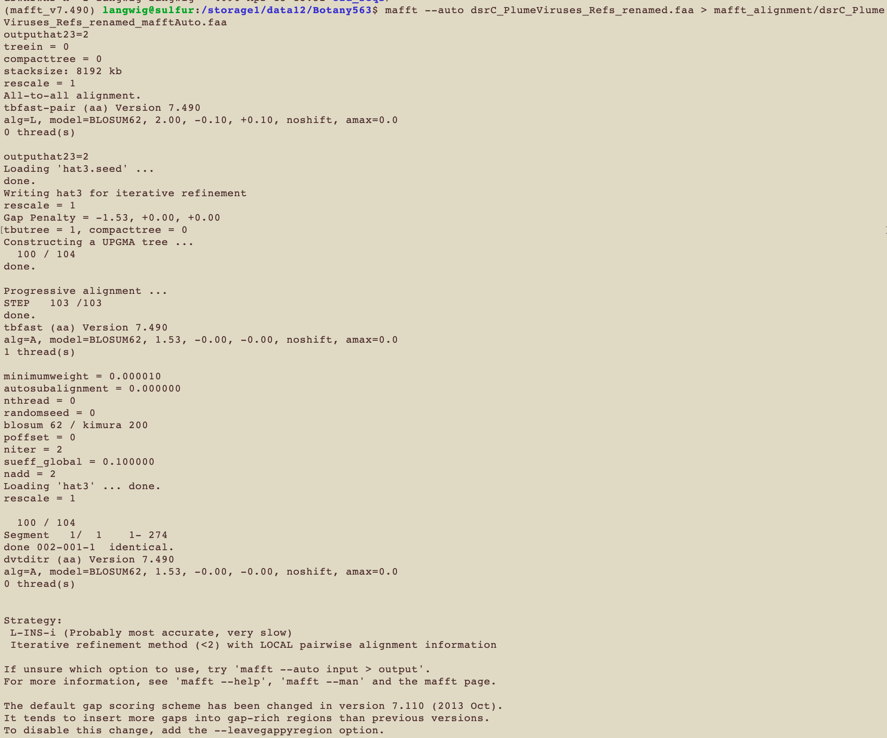

Link to Claudia's helpful guide: [mindful-programming](https://github.com/crsl4/mindful-programming/blob/master/lecture.md)

# Dealing with git conflicts
```
nano best-books.md 

git add .

git commit -m "maggie's book"

git push

git remote add upstream https://github.com/crsl4/phylo-class-social
```

This will produce errors:
```
git pull upstream master
```

To fix it, change the file however you want it to look using nano. Then repeat:

```
nano best-books.md 

git add .

git commit -m "maggie's book"

git push
```
THEN, go to github website and request pull from your own account

Can use this to go back to before you made a change if you haven't done git add:
```
git checkout --
```

# Basics of Git
Look at git config
```
git config -v
```

See what git channels you are connected to:
```
git remote -v
```

If upstream channel is not the one you expect (in our case /crsl4/phylo-class-social), use this to change:
```
git remote add upstream https://github.com/crsl4/phylo-class-social
```

# Reproducibility Homework Part 3
On Github website, fork from [here](https://github.com/crsl4/phylogenetics-class/blob/master/exercises/class-repos.md)

Now git clone your forked repo
```
git clone https://github.com/mlangwig/phylogenetics-class.git
```

See that you are currently linked to your own repos:
```
margueritelangwig@Marguerites-MacBook-Pro phylogenetics-class % git remote -v         
origin	https://github.com/mlangwig/phylogenetics-class.git (fetch)
origin	https://github.com/mlangwig/phylogenetics-class.git (push)
```

So we want to add the original repo upstream to be able to push to it:
```
git remote add upstream https://github.com/crsl4/phylogenetics-class
```

Now check:
```
margueritelangwig@Marguerites-MacBook-Pro phylogenetics-class % git remote -v
origin	https://github.com/mlangwig/phylogenetics-class.git (fetch)
origin	https://github.com/mlangwig/phylogenetics-class.git (push)
upstream	https://github.com/crsl4/phylogenetics-class (fetch)
upstream	https://github.com/crsl4/phylogenetics-class (push)
```

Nano exercises/class-repos.md, add your link, then:
```
git add .

git commit -m "maggie's github link"

git push
```

Now go to the Github website, go to the file that you changed in your forked git repo, click Pull Requests in the top left corner, New pull request (this should show you the changes you made in the file), and then Create pull request

# dsrC class project

Justification: DsrC is a small protein that partners with DsrAB to catalyze dissimilatory sulfur cycling. DsrC is part of a superfamily of proteins that have different names and completely different functions (TusE for biosynthesis of 2-thiouridine, RspA for regulation of gene expression). One way to distinguish between them and find out what function you have is to make a phylogeny.
My phylogeny will include a viral dsrC/tusE that I identified in a virus integrated with Marinobacter to see how it is related to other Marinobacter and viral dsr/tus/rspA sequences.

## Acquire the sequences
1. Get known dsrCs and known tusE references from Uniprot:
[Uniprot search results](https://www.uniprot.org/blast/uniprot/B202202144ABAA9BC7178C81CEBC9459510EDDEA302E3E7D)

2. Download all Marinobacter genomes in NCBI, will search these for dsrC:
[NCBI search results](https://www.ncbi.nlm.nih.gov/datasets/genomes/?taxon=2742&utm_source=gquery&utm_medium=referral)

3. Obtained viral reference sequences of dsrC/tusE from Kris in my lab

4. Get reference sequences from [Venceslau et al., 2014](https://www.sciencedirect.com/science/article/pii/S0005272814000942#f0025)

5. 3 viral sequences identified from hydrothermal plume metagenomes using [VIBRANT](https://microbiomejournal.biomedcentral.com/articles/10.1186/s40168-020-00867-0)

### Identify dsrC/tusE from Marinobacter genomes
Confirm that the genome set you have is actually Marinobacter according to [GTDBtk](https://academic.oup.com/bioinformatics/article/36/6/1925/5626182)
```
gtdbtk classify_wf --genome_dir /storage1/data12/Plume_Viruses/Marinobacter_MAGs/fna --out_dir GTDB -x fna --cpus 10 --pplacer_cpus 10 --tmpdir /storage1/data12/tmp/
```
This resulted in a final set of 344 Marinobacter genomes, compared to the 346 downloaded

Run the hmmsearch using custom sulfur hmm database from our lab
```
for file in sulfur_hmms/*.hmm; do hmmsearch --cut_tc --cpu 15 --tblout $file.txt $file Marinobacter_344genomes.faa; echo "next hmm"; done
```

Paste list of hits into a txt file for extracting seqs
```
nano dsrC_Marinobacter_list.txt
```

Extract them from the genomes
```
perl /storage1/data12/scripts/screen_list_new.pl dsrC_Marinobacter_list.txt ../346_Marinobacter.faa keep > dsrC_Marinobacter.faa
```

## Sequence Totals
In total have:

* 342 seqs from Marinobacter ref genomes: dsrC_Marinobacter.faa
* 250 refs downloaded from Uniprot: uniprot_dsrC_seqs.faa
* 138 IMGVR refs from Kris through teams: DsrC_IMGVR.faa
* 3 dsrCs from VIBRANT characterizations: dsrC_3viruses.faa
* 76 dsrC references from Venceslau et al: Venceslau_76_dsrC.faa 
    
Cat them all for final set of 809 sequences:
```
cat *.faa > dsrC_PlumeViruses_uniprot.faa
```

### Sequence Totals after initial trees

The initial trees I generated showed that there were more sequences in the analysis than necessary so I have decided to cut down the sequence total.

I used the following command to subset my references:
```
perl ~/Google\ Drive/My\ Drive/scripts/screen_list_new.pl seqs_to_keep.txt dsrC_IMGVR_Marino_uniprot.faa keep > dsrC_25Refs.faa
```

The new totals are as follows:

* 25 Marinobacter, Uniprot, and virus references: dsrC_25Refs.faa
* 3 dsrCs from VIBRANT characterizations: dsrC_3viruses.faa
* 76 dsrC references from Venceslau et al: Venceslau_76_dsrC.faa 

Then cat for a total of 104 sequences:
```
cat Venceslau_76_dsrC.faa dsrC_25Refs.faa dsrC_3viruses.faa > dsrC_PlumeViruses_Refs.faa
```

Replace spaces with underscores to preserve names:
```
sed 's/ /_/g' dsrC_PlumeViruses_Refs.faa > dsrC_PlumeViruses_Refs_renamed.faa
```

## **Alignments**

**Remember: there is no perfect alignment method and there is no fully automatic method (manual curation is always required). Every alignment is wrong but some are useful.**

### **Progressive alignments**
Progressive alignments combine pairwise alignments (constructed using Needleman-Wunsch), starting with the most similar pair and progressing to the most distantly related pair. This is done to give more weight to closely related sequences. Why? Imagine you align sequence A and B, which are closely related, and introduce a gap in the alignment. Now you add a third sequence, C, which is more distantly related and rearranges the position of the gap and introduces several more gaps. This is problematic because the alignment is now being optimized for a distantly related sequence, rather than the closely related sequences which are higher confidence. Progressive methods address this by keeping gaps introduced from the initial most closely related sequences and favoring more gaps/changes when adding later and more distantly related sequences.

In the first stage of progressive alignments, standard pairwise alignment (Needleman-Wunsch) is completed. For every pairwise alignment, we calculate its cost based on the cost of a gap and the cost of substitution. **This is why alignment algorithms have a scoring matrix such as BLOSUM62.** 
Alignments depend on the assumptions of the cost of substitutions and costs of gaps. Here is some info about scoring matrices: [WIS.pdf](https://bip.weizmann.ac.il/course/introbioinfo/lecture6/scoringmatrices11.pdf)

Using the scored pairwise alignments, a distance matrix is calculated based on each pair of sequences. Next, a guide tree is constructed using the distance matrix and the Neighbor Joining method (or UPGMA) to represent the relationships between the sequences (which sequences are more and less closely related). Finally, the multiple sequence alignment (MSA) is built by adding sequences to the MSA according to the guide tree, in order of most closely related (at the leaves) to least closely related (at the root). 

It should be noted that progressive methods are heuristics and not guaranteed to converge to a global optimum. Progressive alignments have been described with the phrase "once a gap always a gap" because gaps introduced early in the alignment persist without opportunity for change.

**Method**|**Strengths**|**Limitations**|**Assumptions**
:-----:|:-----:|:-----:|:-----:|
| Progressive Alignment | •Fast for large number of seqs | •The guide tree has a big impact on the alignment <br /> •The guide tree is often inaccurate (because NJ or clustering) <br /> •Errors made early in the alignment persist <br /> •Poor performance with distantly related sequences |  •The NJ tree is an accurate guide tree <br /> •Sequences share a common ancestor <br /> •Sites are independent |


Relevant links and references:

* [Progressive Alignments: Feng and Doolittle, 1987](https://link.springer.com/content/pdf/10.1007/BF02603120.pdf)
* [Lecture 5, Solis-Lemus](https://github.com/crsl4/phylogenetics-class/blob/master/lecture-notes/lecture5.md)
* [Purdue Topic 6](https://www.stat.purdue.edu/~junxie/topic6.pdf)

#### **ClustalW**

Dynamically varies gap penalties in a residue and position specific way. For example, gap penalties are increased if there are no gaps in a column but gaps occur in a nearby column. Distinct from Feng-Doolittle progressive alignments because uses profile alignment methods. 

**Method**|**Strengths**|**Limitations**|**Assumptions**|**Usage notes**
:-----:|:-----:|:-----:|:-----:|:-----:
| ClustalW | •Fast and low RAM usage <br /> •Incorporates biologically relevant gap scoring | •Was lowest accuracy aligner in recent review (Pais et al. 2014) |  • | •   |

References:

* [ClustalW: Thompson, Higgins, and Gibson, 1994](https://www.ncbi.nlm.nih.gov/pmc/articles/PMC308517/)
* [Alignment Assessment: Pais et al., 2014](https://link.springer.com/article/10.1186/1748-7188-9-4#Sec12)
* [Methods Review: Chatzou et al., 2016](https://academic.oup.com/bib/article/17/6/1009/2606431)

#### **ClustalW Commands**
Using the default parameters because unsure what options to select and I do not plan on using this alignment - I'm convinced from literature search that T-Coffee or MAFFT would be more accurate.

```
clustalw -INFILE=dsrC_PlumeViruses_uniprot.faa -align -OUTFILE=dsrC_PlumeViruses_uniprot_clustalw.faa -OUTPUT=FASTA
```

```
clustalw -INFILE=dsrC_PlumeViruses_Refs.faa -align -OUTFILE=dsrC_PlumeViruses_clustalw.faa -OUTPUT=FASTA

clustalw -INFILE=dsrC_PlumeViruses_Refs_renamed.faa -align -OUTFILE=dsrC_PlumeViruses_Refs_renamed_clustalw.faa -OUTPUT=FASTA -STATS=dsrC_PlumeViruses_Refs_renamed_clustalw_stats.txt
```
### **Iterative refinement alignment**

Improvement upon progressive alignments. These complete the same steps as progressive alignment but add on extra steps at the end to improve the alignment. This is also a heuristic method. The method improves the alignment until the alignment score can no longer be improved.

**Method**|**Strengths**|**Limitations**|**Assumptions**
:-----:|:-----:|:-----:|:-----:|
| Iterative Alignment | •Improves upon progressive alignments by correcting errors introduced early in alignment | •Can be difficult to correct alignments built with progressive methods - not guaranteed to improve it to the true alignment |  •The NJ tree is an accurate guide tree <br /> •Sequences share a common ancestor <br /> •Sites are independent |

Relevant links and references:

* [Progressive Alignments: Feng and Doolittle, 1987](https://link.springer.com/content/pdf/10.1007/BF02603120.pdf)
* [Lecture 5, Solis-Lemus](https://github.com/crsl4/phylogenetics-class/blob/master/lecture-notes/lecture5.md)

#### **MAFFT**

Homologous regions identified using fast Fourier transform (FFT), where amino acid sequence is converted to a sequence composed of volume and polarity values of each amino acid residue. Has a progressive method, FFT-NS-2, AND an iterative refinement method, FFT-NS-i.


**Method**|**Strengths**|**Limitations**|**Assumptions**|**Usage notes**
:-----:|:-----:|:-----:|:-----:|:-----:
| MAFFT | •Faster than ClustalW and T-COFFEE <br /> •Has high accuracy options (slower, L-INS-i and G-INS-i) <br /> •Compared against other aligners and was among top performers | •  | • | •Defaults set assuming inputs are distantly related   | •BLOSUM62 matrix by default for AA, 200PAM for DNA |

References:

* [MAFFT: Katoh and Standley, 2013](https://academic.oup.com/mbe/article/30/4/772/1073398?login=true)
* [MAFFT Guide: Katoh et al., 2009](https://link.springer.com/protocol/10.1007/978-1-59745-251-9_3)

#### **MAFFT Commands**
I am using MAFFT because it has been identified as a fast, higher accuracy aligner (Pais et al., 2014). In the help page they suggest using the auto option if you don't know which of their high accuracy options to use so trying that:
```
mafft --auto dsrC_PlumeViruses_uniprot.faa > mafft_alignment/dsrC_PlumeViruses_uniprot_mafftAuto.faa
```

```
mafft --auto dsrC_PlumeViruses_Refs.faa > mafft_alignment/dsrC_PlumeViruses_Refs_mafftAuto.faa
```

```
conda activate mafft_v7.490

mafft --auto dsrC_PlumeViruses_Refs_renamed.faa > mafft_alignment/dsrC_PlumeViruses_Refs_renamed_mafftAuto.faa
```



I downloaded the MAFFT alignment generated using the auto option and masked it in Geneious to remove columns with >50% gaps. This reduces non-informative data in the alignment and can make it easier to see when sequences are low quality or poorly aligned.

## **Phylogenies**

### **Distance trees**
Distance trees fit a tree to a matrix of pairwise genetic distances. First, pairwise distances are calculated based on the fraction of positions in which the two sequences differ. Next, this dissimilarity is converted into an evolutionary distance by applying an evolutionary model or a substitution model (e.g., Jukes Cantor) to estimate the number of substitutions that occurred. Finally, the tree topology can be inferred on the basis of the estimated 
evolutionary distances.

Substitution models used to calculate the evolutionary distance are worth reviewing in and of themselves. They are used in all phylogenetic methods and can have a major effect on tree inference. A lot of new programs have options to test the best substitution model that fits your data. Here is a resource further explaining distance methods and substitution models (evolutionary models): [Nakhlel](https://www.cs.rice.edu/~nakhleh/COMP571/Slides/Phylogenetics-DistanceMethods-Full.pdf)

**Neighbor Joining**: [explanation of method]

**Method**|**Strengths**|**Limitations**|**Assumptions**
:-----:|:-----:|:-----:|:-----:
| Neighbor Joining | •Can produce optimum tree without having to search the tree space <br /> •Fast | •Does not have model flexibility <br /> •Less statistical power because NJ reduces phylogenetic info to 1 value per pair of sequences (non-character based) |  •Your chosen evolutionary model is valid <br /> •Distance calculations are accurate (can be affected by noisy distances)    |

Relevant links and references:

* [Saitou and Nei, 1987](https://pubmed.ncbi.nlm.nih.gov/3447015/)
* [Distance Methods: Nakhlel](https://www.cs.rice.edu/~nakhleh/COMP571/Slides/Phylogenetics-DistanceMethods-Full.pdf)

### **Parsimony trees**

**Maximum Parsimony**: This method seeks to minimize the evolutionary change required to explain the data. In other words, the tree with the fewest common ancestors in most likely. It does not rely on models of evolution and is a character-based method (utilizes 4 nucleotides or 20 amino acids).

**Method**|**Strengths**|**Limitations**|**Assumptions**
:-----:|:-----:|:-----:|:-----:
| Maximum Parsimony | •Intuitive and simple criterion for tree building | •Produce inconsistent trees (especially when there is long branch attraction) <br /> •Limited use for large trees (>1000 taxa) because finding most parsimonious tree becomes NP-hard <br /> •Often underestimates actual evolutionary change | •The tree with the fewest common ancestors is most likely |

Relevant links and references:

* [Camin and Sokal, 1965](https://www.jstor.org/stable/pdf/2406441.pdf)
* [Felsenstein, 1978](https://watermark.silverchair.com/27-4-401.pdf?token=AQECAHi208BE49Ooan9kkhW_Ercy7Dm3ZL_9Cf3qfKAc485ysgAAAugwggLkBgkqhkiG9w0BBwagggLVMIIC0QIBADCCAsoGCSqGSIb3DQEHATAeBglghkgBZQMEAS4wEQQM6zvVOy7HsYFR1i6FAgEQgIICmzHtLDuAfOznd9eXR7Uu2GWcqsZiH3ilRhS72EkF3mteNNDTx-ibu1VcO0yUC-QNdF_f01vViCT2u4UlofQl36h2kN7WpLG_fPSHg_U_cnOJ_CXUxfk1XhBZ6Ng8mgEHmNJMOwj6meuso4IAxP5iRoPU7EaPLiuEBtYukXu-d9BuIlpSQT2-PDIwozhiLsXyxGUFyEX77nce4ldL0RiZryBC5k8JIOKUaXiXZ-OmNjcV7dhrIsHFxlH3gn5Aubjr43m-JEW0TEQ9swS9HWFcQUQ51D7K3Fy6g8-lXvknXNwuZLMZEI5XJBI4vlTzCKMQ_DYNipfQXkdeUYD2dK868G_rjvUSALZGf-6Zu5U6xxYRRYijiczI5SQYNY2pLPzdafTN16aTcydeBZfkcH7TLcGGDzd1Q0huby0IXBvCdX6rYvM8uI2OlCngEnHCO-mHD4sjlqEk7IKtNP0Gj3OONOsuq79bNsanetcJciTULVGdbyjXFJbDdE3FSgPyyYziyEiLVZcM64alaMR7o6L80ZXBhDrSQt0GUZIMAZdpFYdrawMhrBws13M8N7FgT_aMJLLRDooucgSu6j8MgOfJQaWFpf2z3vDMu4uiyYLbSRfaPLdd3omJHAj3wjngywXeMLF7ZSvVds_DTsR6YbCBrkPbeJQjaEfyQ6SAqgYeWsteuhotHsJDIdDmmba6jCNAUVw7zq4eEfMptE9kBvhUL7PTyi-wcuVr-1VvZJm3pmBCsM5qLLMumJMMWACUcEt5bjEarVukSYX3Hm_pTB6WXfTFIR-3IbI3YwctcxGNnc05ug5gON_dMONOaS0wC78htr8vmoMbIZqChNd-bVSZ9VyiZS5EFVP_XWt3XjnLqfdF6wIBo05Df8mzWJM)

### **Maximum Likelihood Trees**

Maximum likelihood estimation is a statistical method for estimating the parameters of a model. In maximum likelihood estimation, the parameters are chosen to maximize the likelihood that the assumed model results in the observed data. Maximum likelihood inference of phylogenies involves three main steps:

  1. Choose a substitution model, or Q matrix, that will be used to calculate evolutionary distances (number of substitutions between two sequences since they diverged from a common ancestor). The models of substitution used in the distance tree calculations also form the basis of likelihood (and Bayesian) phylogenetic reconstruction methods. 
  2. Construct an initial tree (using random topology, NJ, or parsimony) and calculate the likelihood of that tree. Using different starting tree types built using both random and parsimony methods helps ensure that a sufficient tree space is searched and tree searching is not stuck in local optima. 
  3. Change the initial tree using tree moves (e.g., Nearest Neighbor Interchange) to find a tree with a better ML score. Tree moves can be either bold (e.g., Subtree Pruning and Re-grafting & Tree Bisection and Reconnection) or conservative (e.g., Nearest Neighbor Interchange). Repeat this to search the tree space and find higher and higher likelihood trees. Note that the complete tree space is computationally unfeasible to search so heuristics are used to find an optimal or "good enough" tree. In addition, it is computationally unfeasible to compute the true ML score of a tree after a tree move because this would require you to recompute all parameters of the tree (e.g., branch lengths, GTR rates). Thus, for each tree move an approximate likelihood score is computed. 

An issue to consider with maximum likelihood estimation is the idea of a **"rough likelihood surface."** A rough likelihood surface is when data sets have comparatively few sites and a large number of taxa (e.g., 16S rRNA alignment of one thousand+ taxa). In this scenario, the tree search space has a large number of local optima that cannot be distinguished from each other. This can result in a large number of topologically different trees that are statistically indistinguishable. In addition, **tree terraces** in the tree search space can affect likelihood-based phylogenetic inference. A terrace is a set of topologically distinct trees that have the same likelihood score. This can occur when alignments are partitioned (usually by gene) and a completely independent set of branch lengths is estimated for each partition (also called unlinked branch estimates). Terraces can bias bootstrap and Bayesian support values.

**Method**|**Strengths**|**Limitations**|**Assumptions**
:-----:|:-----:|:-----:|:-----:
| Maximum Likelihood | •lower variance than other methods (estimation method least affected by sampling error) <br /> •Robust to violations of assumptions of evolutionary model <br /> •Method is statistically well understood <br /> •Has explicit model of evolution | •Computationally intensive <br /> •Can be susceptible to getting stuck in local optima <br /> •Single gene data alignments are susceptible to rough likelihood surface <br /> •Unlinked branch estimates (supermatrix) susceptible to tree terraces | •The starting tree was not stuck in a poor likelihood region <br /> •A good substitution model was chosen <br /> •The tree space was sufficiently traversed |

Relevant links and references:

* [HALS 1.2](https://hal.archives-ouvertes.fr/hal-02535285v2/document)
* [Principles of Phylogenetics](http://ib.berkeley.edu/courses/ib200a/ib200a_sp2008/April1_MaximumLikelihood.pdf)


#### **IQ-TREE**

Uses parsimony-based randomized stepwise addition order starting trees - note that these can bias the tree search towards specific parts of the tree space and local optima so care should be taken that the tree space has been sufficiently searched. IQ-Tree employs NNI for tree moves and because these get stuck in local optima it occasionally applies completely random NNI moves without taking the likelihood score of these moves into account. This helps ensure it moves out of areas of local optima and is highly likely to move into a state of better likelihood.

IQ-TREE also provides [a guide](http://www.iqtree.org/doc/Assessing-Phylogenetic-Assumptions) to assess phylogenetic assumptions that you can run through before performing phylogenetic analyses. Though this seems optimized for partitioned datasets (multi-gene alignments).

**Method**|**Strengths**|**Limitations**|**Assumptions**|**Usage notes**
:-----:|:-----:|:-----:|:-----:|:-----:
| IQ-TREE | •Recommended in a recent review for accuracy [Lees et al., 2018](https://www.ncbi.nlm.nih.gov/pmc/articles/PMC5930550/) <br /> •Identified as best performer for concatenation-based species tree inference in [Zhou et al., 2018](https://academic.oup.com/mbe/article/35/2/486/4644721) <br /> •Comprehensive [documentation](http://www.iqtree.org/doc/) <br /> •Fast <br /> •Avoids redundant likelihood calculations on a terrace <br /> •IQTree shows lower variance of trees compared to RAxML-NG, so may require fewer replicate searches to find best scoring tree |  •Does not provide mechanism to move away from tree terraces | •  | •Has checkpoints and writes a log file <br /> •Can set max CPU and RAM usage! <br /> •Has option for ancestral state reconstruction <br /> •Default usage auto detects best-fit substitution model and performs [Ultrafast Bootstrap](https://academic.oup.com/mbe/article/35/2/518/4565479?login=true) and [SH-aLRT branch test](https://academic.oup.com/sysbio/article/59/3/307/1702850?login=true) <br /> •Has a web server where can run trees online through a GUI <br /> •-rf to compute RF distances between tree sets |

Relevant links and references:

* [IQ-Tree: Nguyen et al., 2015](https://academic.oup.com/mbe/article/32/1/268/2925592?login=true)
* [IQ-Tree2: Minh et al., 2020](https://academic.oup.com/mbe/article/37/5/1530/5721363)
* [IQ-Tree Online Documentation](http://www.iqtree.org/doc/)


#### **IQ-tree commands**

1. Assess phylogenetic assumptions:
```
nohup iqtree -s dsrC_PlumeViruses_Refs_renamed_mafftAuto_masked.fasta --symtest-only &
```

We do not establish partitions because this is a single gene alignment. The SymPval is >.05 so the assumptions of stationarity or homogeneity or both are Not rejected, meaning we do not have to remove anything.

2. Run the phylogeny: <br />
The following command shows the basic usage. -s is the input alignment. -T sets the number of threads to the best choice given your data and the resources of the computer you are using. -ntmax sets an upper limit to the automated number of threads that are chosen. -bb is the number of bootstrap replicates. 1000 is the minimum number of bootstraps recommended so it is used here. -bnni further optimizes each bootstrap tree using hill-climbing nearest neighbor interchange (NNI) and ensures that branch supports are not overestimated due to severe model violations. No model was specified so IQ-TREE will use ModelFinder to determine the best-fit model given the alignment data. "ModelFinder computes the log-likelihoods of an initial parsimony tree for many different models and the Akaike information criterion (AIC), corrected Akaike information criterion (AICc), and the Bayesian information criterion (BIC). Then ModelFinder chooses the model that minimizes the BIC score."
```
nohup iqtree -s dsrC_PlumeViruses_Refs_renamed_mafftAuto_masked.fasta -T AUTO -ntmax 15 -bnni -bb 1000 &
```

#### **IQ-TREE Results**

* Best-fit model: LG+G4 chosen according to BIC
* Optimal log-likelihood: -9607.728
* Gamma shape alpha: 1.555
* Total run time ~6 min


#### **RAxML-NG**

RAxML-NG is RAxML Next Generation. It is the successor of RAxML and claims to be faster, easier to use, and more flexible than the previous version. **Importantly, this version includes checkpointing so trees can be resumed if the run is stopped.** This is the most up to date RAxML version and includes new options that are relevant to current phylogenetic research (e.g., tree terraces). The search heuristic iteratively performs Subtree Pruning and Regrafting (SPR) moves during the tree search. Some random notes on usage: Stamatakis recommends checking the Robinson-Foulds distances between all pairs of starting trees to determine how many distinct trees are in the starting set. Also, RAxML-NG uses the same parsimony-based randomized stepwise addition order starting trees as IQ-Tree, so care should be taken that the tree space has been sufficiently searched. 

**Method**|**Strengths**|**Limitations**|**Assumptions**|**Usage notes**
:-----:|:-----:|:-----:|:-----:|:-----:
| RAxML-NG | •Recommended in a recent review for accuracy [Lees et al., 2018](https://www.ncbi.nlm.nih.gov/pmc/articles/PMC5930550/) <br /> •Has checkpointing! <br /> •Documentation is [comprehensive](https://github.com/amkozlov/raxml-ng/wiki/Tutorial) <br /> •Can detect tree terraces <br /> •Avoids redundant likelihood calculations on a terrace <br /> •Computes transfer bootstrap expectation (TBE), better suited for well-supported deep splits in large trees | •Does not provide mechanism to move away from tree terraces  | • | •-rfdist to determine how many distinct trees the starting tree set has <br /> •Uses lazy SPR move for tree search <br /> •Default optimizes all free model parameters (substitution rates, alpha, and branch lengths) <br /> •Uses checkpoints, parallelization, and writes a log file <br /> •Has option for ancestral state reconstruction |

Relevant links and references: 

* [HALS 1.3: Using RAxML-NG in Practice](https://hal.archives-ouvertes.fr/hal-02535311/document)
* [RAxML-NG: Kozlov et al., 2019](https://academic.oup.com/bioinformatics/article/35/21/4453/5487384?login=true)
* [RAxML-III: Stamatakis and Meier, 2005](https://academic.oup.com/bioinformatics/article/21/4/456/203612?login=true#2092683)
* [RAxML Meets the IBM Cell: Stamatakis et al., 2007](https://cme.h-its.org/exelixis/pubs/VLSI2007.pdf)
* [RAxML-NG Github](https://github.com/amkozlov/raxml-ng)

### **Bayesian Trees**

In Bayesian methods, your prior knowledge about your data is incorporated as **priors**, used in the likelihood estimation of phylogenies and the parameters based on your data, and then results in a distribution of trees and parameters, also known as the **posterior distribution**. Considerations in Bayesian phylogenetic analysis that are distinct from maximum likelihood inference include: what prior model should I choose? What assumptions are included in the priors are how do those affect inference? With sufficient data, the priors do not matter and the correct tree will be found. With non-informative flat priors, Bayesian analysis is the same as maximum likelihood inference. The benefit of completing a Bayesian analysis with flat priors it that you obtain the posterior distribution of the phylogenetic trees and the parameters, rather than one single tree that has the highest likelihood.

Bayesian inference uses MCMC chains to search the space of posterior distributions. This must be done for every parameter included. When you obtain results of a Bayesian phylogenetic analysis, it is very important to consider **mixing, convergence, and burnin**. Mixing refers to how well you navigated the parameter space. Convergence is if you reached all regions of high posterior values. Burnin is how long it takes to reach regions of high posterior values - if you have a bad prior, this time can be very long and prevent the MCMC chain from reaching areas of high posterior value. To assess these aspects, look at **trace plots** using a program such as [Tracer]().

**Method**|**Strengths**|**Limitations**|**Assumptions**
:-----:|:-----:|:-----:|:-----:
| Bayesian | •Can incorporate biologically relevant data into tree calculation <br /> •Can use flat priors to conduct a max likelihood search and obtain the distribution of max likelihood trees | •Can be difficult to choose priors and know if they are accurate <br /> •Slow | •The tree space was sufficiently traversed <br /> •The MCMC converged <br /> •The same assumptions as likelihood |

Relevant links and references:

* [HALS 1.2](https://hal.archives-ouvertes.fr/hal-02535285v2/document)
* [Lecture 12, Solis-Lemus](https://github.com/crsl4/phylogenetics-class/blob/master/lecture-notes/lecture12.pdf)

#### **MrBayes**

[explanation of method] 

**Method**|**Strengths**|**Limitations**|**Assumptions**|**Usage notes**
:-----:|:-----:|:-----:|:-----:|:-----:
| MyBayes | • <br /> • |  •    | •  | •Has option to initiate MCMC on a randomized stepwise addition order parsimony |

Relevant links and references:

* [MrBayes: ]()

